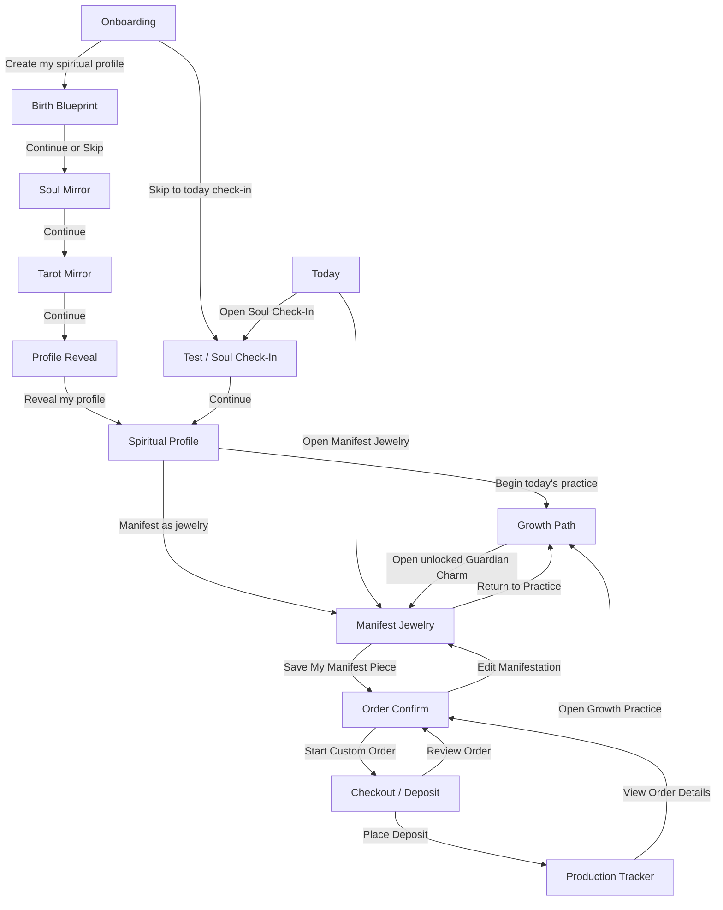

# AuraGarden v1.0.0 原型图与跳转关系

版本：v1.0.0  
原型目录：`work/aura-garden-prototype`  
页面资产目录：`public/screens`  
实现文件：`src/App.jsx`  
当前运行地址：`http://127.0.0.1:5177/`

## 1. 原型实现说明

当前高保真原型采用「UI 截图资产 + 透明点击热区 + React 状态切换」实现。这样可以最大限度保持已确认 UI 图的视觉一致性。

当前原型使用的视觉资产为 WebP：

- 运行时引用：`public/screens/*.webp`
- 源图备份：`public/screens/*.png`
- 底部导航：由 React 统一覆盖渲染，避免每页静态图导航不一致或不可点击。

## 2. 页面清单

| 页面 ID | 页面名称 | 当前资产 | 页面角色 | 底部导航 |
| --- | --- | --- | --- | --- |
| onboarding | Onboarding | `public/screens/onboarding.webp` | 首次进入与产品主张 | 否 |
| birth | Birth Blueprint | `public/screens/birth-blueprint.webp` | 出生信息采集 | 否 |
| soul | Soul Mirror | `public/screens/soul-mirror.webp` | 直觉能量测试 | 否 |
| tarot | Tarot Mirror | `public/screens/tarot-mirror.webp` | 塔罗镜像 | 否 |
| reveal | Profile Reveal | `public/screens/profile-reveal.webp` | 画像生成仪式页 | 否 |
| profile | Spiritual Profile | `public/screens/profile.webp` | 融合灵性画像 | 是 |
| today | Today | `public/screens/today.webp` | 每日首页 | 是 |
| test | Soul Check-In | `public/screens/test.webp` | 每日灵性测试 | 是 |
| growth | Growth Path | `public/screens/growth.webp` | 灵性养成 | 是 |
| jewelry | Manifest Jewelry | `public/screens/jewelry.webp` | 珠宝显化定制 | 是 |
| order | Order Confirm | `public/screens/order-confirm.webp` | 订单确认 | 否 |
| checkout | Checkout / Deposit | `public/screens/checkout.webp` | 订金/支付 | 否 |
| tracker | Production Tracker | `public/screens/production-tracker.webp` | 生产跟踪 | 否 |
| circle | Circle | `public/screens/circle.webp` | 轻社交 | 是 |

## 3. 主流程跳转图

## 4. 底部导航规则

底部导航项：

| Tab | 目标页面 |
| --- | --- |
| Today | `today` |
| Test | `test` |
| Growth | `growth` |
| Jewelry | `jewelry` |
| Circle | `circle` |

显示底部导航的页面：

- `today`
- `test`
- `growth`
- `jewelry`
- `circle`
- `profile`

不显示底部导航的页面：

- `onboarding`
- `birth`
- `soul`
- `tarot`
- `reveal`
- `order`
- `checkout`
- `tracker`

说明：`profile` 虽然不是主 Tab，但它是长期用户资产页，用户需要能从这里快速切回 Today / Test / Growth / Jewelry / Circle。

## 5. 返回关系

| 当前页面 | 返回目标 |
| --- | --- |
| birth | onboarding |
| soul | birth |
| tarot | soul |
| reveal | tarot |
| test | today |
| profile | reveal |
| growth | today |
| jewelry | growth |
| order | jewelry |
| checkout | order |
| tracker | checkout |
| circle | today |

说明：当前返回关系按主旅程设置。后续组件化后可以引入 history stack，让用户从不同入口进入同一页面时返回真实上一页。

## 6. 页面级交互清单

### onboarding

| 热区 | 目标 |
| --- | --- |
| Create my spiritual profile | birth |
| Skip to today's check-in | test |

### birth

| 热区 | 目标 |
| --- | --- |
| Continue to Soul Mirror | soul |
| Skip birth blueprint | soul |

### soul

| 热区 | 目标 |
| --- | --- |
| Continue to Tarot Mirror | tarot |

### tarot

| 热区 | 目标 |
| --- | --- |
| Continue to Profile Reveal | reveal |

### reveal

| 热区 | 目标 |
| --- | --- |
| Reveal my profile | profile |

### today

| 热区 | 目标 |
| --- | --- |
| Open Soul Check-In | test |
| Open Manifest Jewelry | jewelry |

### test

| 热区 | 目标 |
| --- | --- |
| Continue to Spiritual Profile | profile |

说明：当前版本不在静态 UI 图上叠加选中态，避免视觉残留。后续要做真实选择时，建议组件化重建测试卡片。

### profile

| 热区 | 目标 |
| --- | --- |
| Begin today's practice | growth |
| Manifest as jewelry | jewelry |

### growth

| 热区 | 目标 |
| --- | --- |
| Open unlocked Guardian Charm | jewelry |

说明：当前版本不叠加任务勾选态，避免与静态图错位。后续应在组件化 Growth 页面中实现勾选、取消和经验值变化。

### jewelry

| 热区 | 目标 |
| --- | --- |
| Begin custom order | order |
| Return to practice | growth |

说明：当前版本不叠加 Stone / Metal / Charm / Size 选中态。后续应在组件化 Jewelry 页面中实现配置选择、价格联动和库存校验。

### order

| 热区 | 目标 |
| --- | --- |
| Start custom order | checkout |
| Edit manifestation | jewelry |

### checkout

| 热区 | 目标 |
| --- | --- |
| Place deposit | tracker |
| Review order | order |

### tracker

| 热区 | 目标 |
| --- | --- |
| Open growth practice | growth |
| View order details | order |

### circle

| 热区 | 目标 |
| --- | --- |
| 底部导航 | today / test / growth / jewelry / circle |

## 7. 资产整理清单

| 页面 | WebP 运行资产 | PNG 源图 |
| --- | --- | --- |
| Onboarding | `public/screens/onboarding.webp` | `public/screens/onboarding.png` |
| Birth Blueprint | `public/screens/birth-blueprint.webp` | `public/screens/birth-blueprint.png` |
| Soul Mirror | `public/screens/soul-mirror.webp` | `public/screens/soul-mirror.png` |
| Tarot Mirror | `public/screens/tarot-mirror.webp` | `public/screens/tarot-mirror.png` |
| Profile Reveal | `public/screens/profile-reveal.webp` | `public/screens/profile-reveal.png` |
| Today | `public/screens/today.webp` | `public/screens/today.png` |
| Test | `public/screens/test.webp` | `public/screens/test.png` |
| Spiritual Profile | `public/screens/profile.webp` | `public/screens/profile.png` |
| Growth Path | `public/screens/growth.webp` | `public/screens/growth.png` |
| Manifest Jewelry | `public/screens/jewelry.webp` | `public/screens/jewelry.png` |
| Order Confirm | `public/screens/order-confirm.webp` | `public/screens/order-confirm.png` |
| Checkout / Deposit | `public/screens/checkout.webp` | `public/screens/checkout.png` |
| Production Tracker | `public/screens/production-tracker.webp` | `public/screens/production-tracker.png` |
| Circle | `public/screens/circle.webp` | `public/screens/circle.png` |

## 8. 验收路径

### 8.1 首次画像路径

`onboarding -> birth -> soul -> tarot -> reveal -> profile`

验收点：

- 每一步 CTA 可点击。
- 返回按钮可逐级返回。
- Profile 页面底部导航可点击。

### 8.2 日常练习路径

`today -> test -> profile -> growth`

验收点：

- Today 的 Soul Check-In 入口可进入 Test。
- Test Continue 可进入 Profile。
- Profile 的 Begin today's practice 可进入 Growth。

### 8.3 商业转化路径

`jewelry -> order -> checkout -> tracker -> growth`

验收点：

- Jewelry 的 Save My Manifest Piece 可进入 Order Confirm。
- Order Confirm 可进入 Checkout。
- Checkout 支付后可进入 Production Tracker。
- Production Tracker 可回到 Growth，形成购买后的养成回流。

### 8.4 主导航路径

在 `today / test / profile / growth / jewelry / circle` 页面点击：

`Today / Test / Growth / Jewelry / Circle`

验收点：

- 每个 Tab 均可点击。
- 当前 Tab 有激活态。
- Profile 页面也能点击底部导航。

## 9. 后续组件化建议

优先级建议：

1. Test：先组件化测试选项、选中/取消、继续按钮，因为这是最高频入口。
2. Growth：组件化任务勾选、经验值变化、等级进度。
3. Jewelry：组件化宝石/金属/吊坠/尺寸选择、价格和推荐理由联动。
4. Checkout：接入真实支付前的表单校验和订单数据结构。
5. Circle：从静态信息流升级为发帖、点赞、回应、主题挑战。

